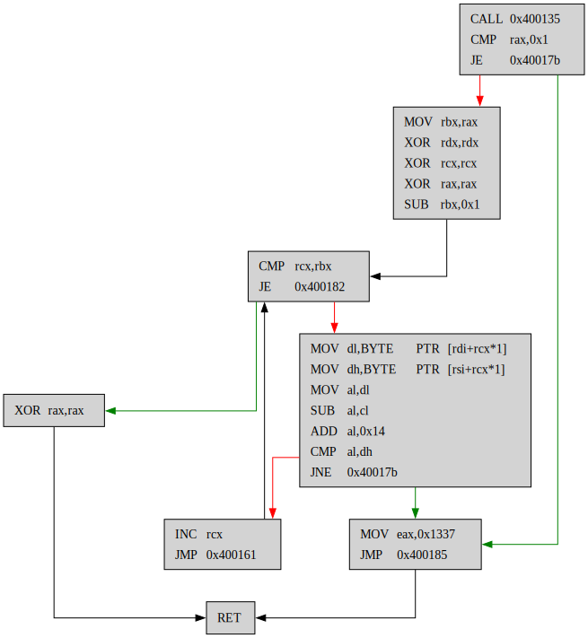

# x86_64 Assembly renderer

This project allows the rendering of some given assembly code as a graph tree, as featured in software such as Ghidra or IDA Pro.

In its current version, this script can only render simple functions and hasn't been tested on code with multiple return statements.

## Requirements

- Python 3.x
- Graphviz

## Example

```assembly
0x0000000000400146:	call	0x400135
0x000000000040014b:	cmp	rax,0x1
0x000000000040014f:	je	0x40017b
0x0000000000400151:	mov	rbx,rax
0x0000000000400154:	xor	rdx,rdx
0x0000000000400157:	xor	rcx,rcx
0x000000000040015a:	xor	rax,rax
0x000000000040015d:	sub	rbx,0x1
0x0000000000400161:	cmp	rcx,rbx
0x0000000000400164:	je	0x400182
0x0000000000400166:	mov	dl,BYTE	PTR	[rdi+rcx*1]
0x0000000000400169:	mov	dh,BYTE	PTR	[rsi+rcx*1]
0x000000000040016c:	mov	al,dl
0x000000000040016e:	sub	al,cl
0x0000000000400170:	add	al,0x14
0x0000000000400172:	cmp	al,dh
0x0000000000400174:	jne	0x40017b
0x0000000000400176:	inc	rcx
0x0000000000400179:	jmp	0x400161
0x000000000040017b:	mov	eax,0x1337
0x0000000000400180:	jmp	0x400185
0x0000000000400182:	xor	rax,rax
0x0000000000400185:	ret
```

becomes:

